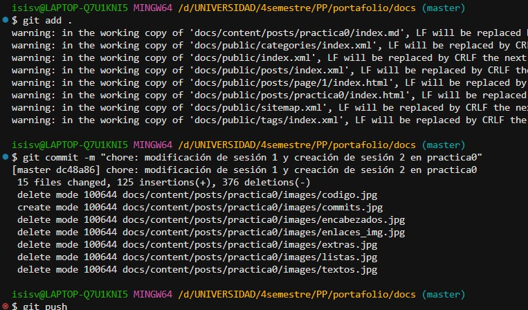
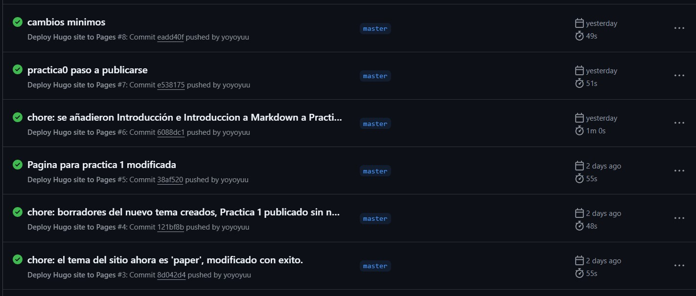
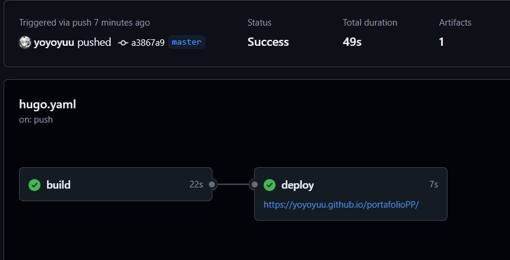

+++
date = '2025-02-21T10:18:18-08:00'
draft = false
title = 'Practica0: Markdown, git & Hugo'
+++
<!--Comentario xd-->

## Indice xd

1. [Introducción](#introducción)
2. [Introducción a Markdown](#sesión-1-introducción-a-markdown)
   1. [Encabezados](#encabezados)
   2. [Textos](#textos)
   3. [Listas](#listas)
   4. [Enlaces e imagenes](#enlaces-e-imagenes)
   5. [Código](#código)
   6. [Extras](#extras)
3. [Uso de Git y Github](#sesión-2-uso-de-git-y-github)
4. [Creación de páginas estáticas](#sesión-3-creación-de-páginas-estáticas)

## Introducción

Durante el desarrollo de esta practica, nos adentramos en diversos temas relacionados al desarrollo de paginas web, con el proposito de crear la base de lo que seria nuestro **portafolio** para la materia de paradigmas de la programación.
El desarrollo de esta practica se dividió en 3 sesiones:

1. **Introducción a Markdown**
2. **Uso de Git y GitHub**
3. **Creación de páginas estáticas**

Ahora, entraremos más a detalle en cada una de estas sesiones.

---

## Sesión 1: Introducción a Markdown

Uno de los resultados que queriamos obtener al realizar esta practica, era aprender a usar los distintos tipos de formatos que le podemos dar a un texto y como los podemos implementar al momento de usarlos, para que puedan ser visualizados de manera clara y concisa. Existen diversas formas de hacerlo, pero a veces, el sistema puede detectar ciertos "errores" los cuales se muestran con una linea amarilla debajo del texto.
Aunque no te detienen de usarlas y estas se pueden visualizar, es recomendable seguir las normas que este lenguaje nos proporciona.
A continuación, se muestran los formatos que aprendimos:

* ### Encabezados

En primera instancia, hicimos uso de los títulos, los cuales nos permiten darle un encabezado a nuestro texto, la forma en que las diferenciamos dependia de cuantos # implementabamos en cada uno de los encabezados, siendo el de un # el que siempre debe estar en la parte superior de la pagina.

En total, tenemos 5 maneras de implementar encabezados:

# Encabezado con 1 hashtag

## Encabezado con 2 hashtag

### Encabezado con 3 hashtag

#### Encabezado con 4 hashtag

##### Encabezado con 5 hashtag

* ### Textos

Pasamos a darle formato al texto, basado en los diferentes tipos de formato que podemos implementar en un texto sencillo:

<!--ITALICA-->
*intalica*: usando asteriscos al inicio y al final del texto.

_intalica_ usando guiones bajos al inicio y al final del texto.

<!--ITALICA-->
**negrita** usando doble asterisco al inicio y al final del texto.

__negrita__ usando doble guion bajo al inicio y al final del texto.

<!--TACHADO-->
~~tachado~~ usando doble tilde al inicio y al final del texto.

<!--SUBRAYADO (no soportado por markdown)-->
<u>subrayado</u> usando etiquetas HTML.

> Notese que el formato de subrayado no se proyecta en el sitio, esto se debe a que Markdown no soporta este tipo de formato para textos. Aqui se usa el formato para .HTML, pero como estamos trabajando con un archivo .md, el sitio no lo visualizará.

* ### Listas

La forma en que implementamos las listas no es tan diferente a como lo hacemos con un editor de texto promedio (word, docs, etc.).
Se dividen en dos tipos:

**Listas ordenadas:** donde se le asigna un número a cada elemento de la lista.

1. Elemento 1
2. Elemento 2
3. Elemento 3
   1. Elemento 3.1
   2. Elemento 3.2
      1. Elemento 3.2.1
4. Elemento 4

**Listas desordenadas:** donde se utiliza un asterisco para indicar que es un elemento de la lista.
  
* Elemento 1
* Elemento 2
* Elemento 3
  * Elemento 3.1
  * Elemento 3.2
  * Elemento 3.3
    * Elemento 3.3.1
* Elemento 4
  
Basta con hacer uso de tabulación para poder implementar subsecciones en cada lista.

* ### Enlaces e imagenes

Markdown nos permite implementar enlaces e imagenes de forma sencilla, siguen un formato similar, pero con algunas diferencias. Ambos nos permiten agregar texto alternativo que podemos visualizar al pasar nuestro cursor por encima de dicho enlace o imagen.

Ambos requieren de un enlace que les permita redirigir a otra página o para poder acceder a la imagen, aunque tambien podemos implementar imagenes de forma local accediendo a la ruta de dicha imagen.

De igual forma, las imagenes tambien nos permiten asignarles algun enlace donde, al hacer clic en la imagen, nos redirigirá a la página que queramos.

<!--ENLACES-->
* [Google](https://www.google.com "Google")

* [UABC](https://www.uabc.mx "Sitio web de la UABC")

***

> La imagen a continuación fue obtenida desde internet, obteniendo la ruta de la imagen donde fue publicada.

<!--IMAGENES-->


> La imagen a continuación fue asignada de forma local, tiene un enlace a google.

[](https://www.google.com)

* ### Código
  
Markdown nos permite implementar código de forma sencilla, usando dos comillas sencillas para una sola parte de un texto, o 3 pares de comillas sencillas entre texto, el cual representará dicho código.

Podemos especificar que tipo de formato o lenguaje usará el texto dentro de los pares de 3 comillas, escribiendo el nombre del formato en la mimsa linea y despues de las primeras 3 comillas simples.

El codigo obtendrá el formato que le hayamos asignado:
<!--CODIGO-->

`Simple linea de texto, usando dos comillas al inicio y al final.`

```txt
Texto en formato .txt
```

```python
print("formato .py")
```

```c
#include <stdio.h>

int main()
{
    printf("formato .c");

    return 0;
}
```

```html
<h1>formato .html</h1>
```

* ### Extras

En Markdown podemos implementar otros elementos adicionales, que nos permitiran hacer nuestro texto más atractivo y fácil de leer. Algunos de estos elementos son:

<!--TABLAS-->
| Columna 1 | Columna 2 | Columna 3 |
|-----------|-----------|-----------|
| Elemento 1 | Elemento 2 | Elemento 3 |
| Elemento 4 | Elemento 5 | Elemento 6 |

<!--NOTAS-->
> Esto es una nota

<!--TAREAS-->
* [x] Primera tarea
* [ ] Segunda tarea
* [x] Tercera tarea
* [ ] Cuarta tarea

<!--DIVISORES HORIZONTALES-->
***

---

___

El resultado más obvio, fue el archivo que se esta visualizando en este momento, usando el formato de Markdown y presentarlo usando la herramienta de Hugo, toda la estructura de este sitio está hecha por medio del uso de markdown.

---

## Sesión 2: Uso de Git y Github

En esta sesion, aprendimos a utilizar un sistema de control de versiones llamado Git, lo cual nos permite tener un buen control del desarrollo de nuestros proyectos, teniendo control de todas las versiones que se han guardado.
Aprendimos a usar la terminal de Git Bash, para poder realizar las acciones que queriamos realizar en nuestro proyecto, como agregar, eliminar y actualizar nuestro proyecto, visualizando las versiones que haciamos en cada momento que guardabamos.



Así mismo, aprendimos a utilizar Github, una plataforma en línea que nos permite subir nuestros proyectos a la nube y compartirlos con otros, creando repositorios para cada uno de esos.
Desde la terminal de Git Bash, hemos podido realizar acciones como:

- `git add .` para agregar todos los cambios realizados en el proyecto.
- `git commit -m "mensaje_del_commit"` para guardar los cambios con un mensaje descriptivo.
- `git push origin master` para subir los cambios a Github.

Asi mismo, existen otros comandos que se usan comunmente al usar Git y Github, por ejemplo:

- `git status` para ver el estado de los cambios realizados en el proyecto.
- `git log` para ver el historial de commits realizados en el repositorio.
- `git pull origin master` para descargar los cambios de Github al repositorio local.
- `git branch nombre_de_la_rama` para crear una nueva rama.
- `git checkout nombre_de_la_rama` para cambiar de rama.
- `git merge nombre_de_la_rama` para mezclar los cambios de una rama con la actual.
- `git remote add origin https://github.com/usuario/repositorio.git` para agregar un repositorio remoto.

Los cambios,  visualizarlo desde nuestro perfil de Github. Donde tenemos un repositorio dedicado a este proyecto.



---

## Sesión 3: Creación de páginas estáticas

En esta sesion, aprendimos a utilizar un generador de sitios web llamado _Hugo_, el cual nos permite crear páginas web estáticas de manera rápida y sencilla, usando los conocimientos posteriores de markdown y git.


De igual manera, implementamos el uso de Github Actions, para automatizar el proceso de creación de nuestro sitio web y visualizar las diversas versiones de la misma.



GitHub Actions es una herramienta de automatización que nos permite definir flujos de trabajo personalizados para nuestras aplicaciones. Esto es especialmente útil cuando usamos Hugo, ya que pude configurar un flujo de trabajo que automáticamente me construia y desplegaba el sitio web cada vez que hacia cambios en el repositorio. Además, con GitHub Pages, podemos publicar nuestro sitio directamente desde el repositorio, haciendo que el proceso de desarrollo y despliegue sea mucho más eficiente.
