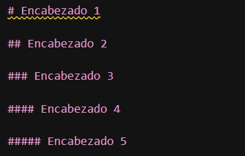
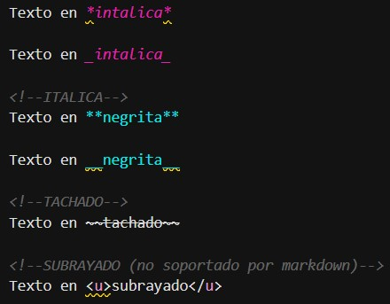
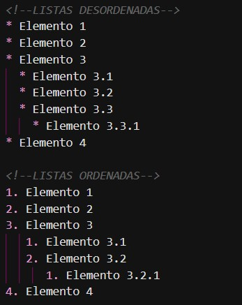
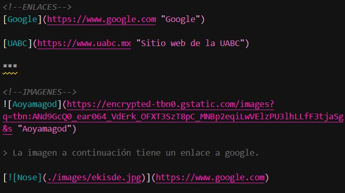
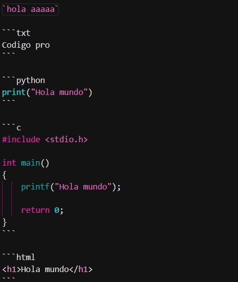
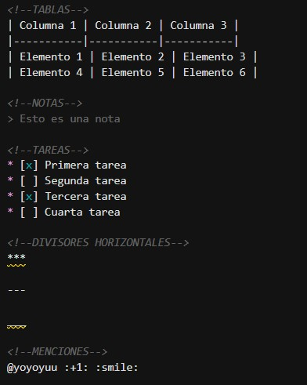

+++
date = '2025-02-21T10:18:18-08:00'
draft = false
title = 'Practica0: Markdown, git & Hugo'
+++
<!--Comentario xd-->

## Indice

1. [Introducción](#introducción)
2. [Introducción a Markdown](#sesión-1-introducción-a-markdown)
   1. [Encabezados](#encabezados)
   2. [Textos](#textos)
   3. [Listas](#listas)
   4. [Enlaces e imagenes](#enlaces-e-imagenes)
   5. [Código](#código)
   6. [Extras](#extras)
3. [Uso de Git y Github](#sesión-2-uso-de-git-y-github)
4. [Creación de páginas estáticas](#sesión-3-creación-de-páginas-estáticas)

## Introducción

Durante el desarrollo de esta practica, nos adentramos en diversos temas relacionados al desarrollo de paginas web, con el proposito de crear la base de lo que seria nuestro **portafolio** para la materia de paradigmas de la programación.
El desarrollo de esta practica se dividió en 3 sesiones:

1. **Introducción a Markdown**: En esta sesion, aprendimos a utilizar un lenguaje de marcado ligero, el cual nos permite crear textos con formato sin necesidad de utilizar HTML, con una estructura básica y fácil de leer. Aprendimos a hacer uso de los diferentes elementos que ofrece markdown, como títulos, listas, enlaces, etc.
2. **Uso de Git y GitHub**: En esta sesion, aprendimos a utilizar un sistema de control de versiones llamado Git, lo cual nos permite tener un buen control del desarrollo de nuestros proyectos, teniendo control de todas las versiones que se han guardado. Así mismo, aprendimos a utilizar Github, una plataforma en línea que nos permite subir nuestros proyectos a la nube y compartirlos con otros, creando repositorios para cada uno de esos.
3. **Creación de páginas estáticas**: En esta sesion, aprendimos a utilizar un generador de sitios web llamado _Hugo_, el cual nos permite crear páginas web estáticas de manera rápida y sencilla, usando los conocimientos posteriores de markdown y git. De igual manera, implementamos el uso de Github Actions, para automatizar el proceso de creación de nuestro sitio web y visualizar las diversas versiones de la misma.

Ahora, entraremos más a detalle en cada una de estas sesiones.

---

## Sesión 1: Introducción a Markdown

Uno de los resultados que queriamos obtener al realizar esta practica, era aprender a usar los distintos tipos de formatos que le podemos dar a un texto y como los podemos implementar al momento de usarlos, para que puedan ser visualizados de manera clara y concisa. Existen diversas formas de hacerlo, pero a veces, el sistema puede detectar ciertos "errores" los cuales se muestran con una linea amarilla debajo del texto.
Aunque no te detienen de usarlas y estas se pueden visualizar, es recomendable seguir las normas que este lenguaje nos proporciona.
A continuación, se muestran los formatos que aprendimos:

* ### Encabezados

En primera instancia, hicimos uso de los títulos, los cuales nos permiten darle un encabezado a nuestro texto, la forma en que las diferenciamos dependia de cuantos # implementabamos en cada uno de los encabezados, siendo el de un # el que siempre debe estar en la parte superior de la pagina.

En total, tenemos 5 maneras de implementar encabezados:



Dando como resultado los encabezados mostrados a continuación, con el formato implementado en cada uno de ellos:

# Encabezado 1

## Encabezado 2

### Encabezado 3

#### Encabezado 4

##### Encabezado 5

* ### Textos

Pasamos a darle formato al texto, basado en los diferentes tipos de formato que podemos implementar en un texto sencillo:



<!--ITALICA-->
Texto en *intalica*

Texto en _intalica_

<!--ITALICA-->
Texto en **negrita**

Texto en __negrita__

<!--TACHADO-->
Texto en ~~tachado~~

<!--SUBRAYADO (no soportado por markdown)-->
Texto en <u>subrayado</u>

> Notese que el formato de subrayado no se proyecta en el sitio, esto se debe a que Markdown no soporta este tipo de formato para textos. Aqui se usa el formato para .HTML, pero como estamos trabajando con un archivo .md, el sitio no lo visualizará.

* ### Listas

La forma en que implementamos las listas no es tan diferente a como lo hacemos con un editor de texto promedio (word, docs, etc.).
Se dividen en dos tipos:

* **Listas ordenadas:** basadas en enumeración.
* **Listas desordenadas:** basadas en asteriscos.
  
Basta con hacer uso de tabulación para poder implementar subsecciones en cada lista.



La forma en que se ven en mi sitio es la siguiente:

<!--LISTAS DESORDENADAS-->
#### Desordenadas

* Elemento 1
* Elemento 2
* Elemento 3
  * Elemento 3.1
  * Elemento 3.2
  * Elemento 3.3
    * Elemento 3.3.1
* Elemento 4

<!--LISTAS ORDENADAS-->
#### Ordenadas

1. Elemento 1
2. Elemento 2
3. Elemento 3
   1. Elemento 3.1
   2. Elemento 3.2
      1. Elemento 3.2.1
4. Elemento 4

* ### Enlaces e imagenes

Markdown nos permite implementar enlaces e imagenes de forma sencilla, siguen un formato similar, pero con algunas diferencias. Ambos nos permiten agregar texto alternativo que podemos visualizar al pasar nuestro cursor por encima de dicho enlace o imagen.

Ambos requieren de un enlace que les permita redirigir a otra página o para poder acceder a la imagen, aunque tambien podemos implementar imagenes de forma local accediendo a la ruta de dicha imagen.

De igual forma, las imagenes tambien nos permiten asignarles algun enlace donde, al hacer clic en la imagen, nos redirigirá a la página que queramos.



Así apareceran nuestros enlaces e imagenes en mi sitio:

<!--ENLACES-->
* [Google](https://www.google.com "Google")

* [UABC](https://www.uabc.mx "Sitio web de la UABC")

***

<!--IMAGENES-->


> La imagen a continuación tiene un enlace a google.

[](https://www.google.com)

* ### Código
  
Markdown nos permite implementar código de forma sencilla, usando dos comillas sencillas para una sola parte de un texto, o 3 pares de comillas sencillas entre texto, el cual representará dicho código.

Podemos especificar que tipo de formato o lenguaje usará el texto dentro de los pares de 3 comillas, escribiendo el nombre del formato en la mimsa linea y despues de las primeras 3 comillas simples.



El codigo obtendrá el formato que le hayamos asignado:
<!--CODIGO-->

`Simple linea de texto`

```txt
Texto en formato .txt
```

```python
print("formato .py")
```

```c
#include <stdio.h>

int main()
{
    printf("formato .c");

    return 0;
}
```

```html
<h1>formato .html</h1>
```

* ### Extras

En Markdown podemos implementar otros elementos adicionales, que nos permitiran hacer nuestro texto más atractivo y fácil de leer. Algunos de estos elementos son:



Y la forma en que aparecen es asi:

<!--TABLAS-->
| Columna 1 | Columna 2 | Columna 3 |
|-----------|-----------|-----------|
| Elemento 1 | Elemento 2 | Elemento 3 |
| Elemento 4 | Elemento 5 | Elemento 6 |

<!--NOTAS-->
> Esto es una nota

<!--TAREAS-->
* [x] Primera tarea
* [ ] Segunda tarea
* [x] Tercera tarea
* [ ] Cuarta tarea

<!--DIVISORES HORIZONTALES-->
***

---

___

<!--MENCIONES-->
@yoyoyuu :+1: :smile:

Pudimos hacer uso de casi todas estas funciones en el desarrollo de la primera sesión, permitiendonos pasar a la siguiente sección.

## Sesión 2: Uso de Git y Github

## Sesión 3: Creación de páginas estáticas
